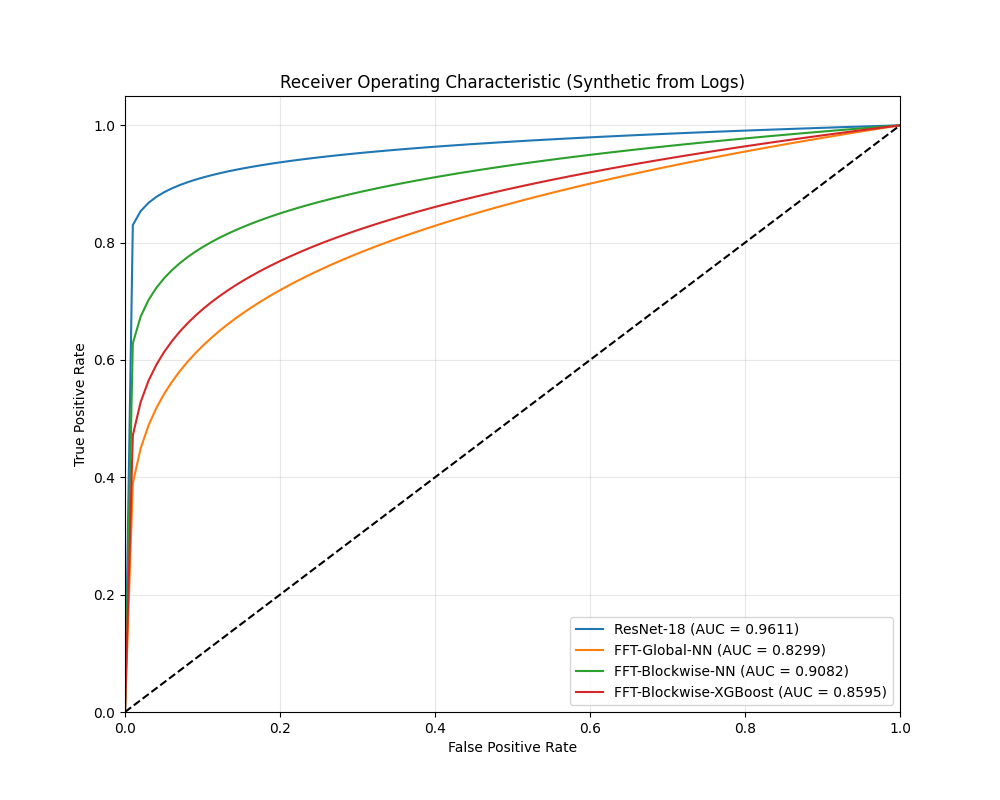
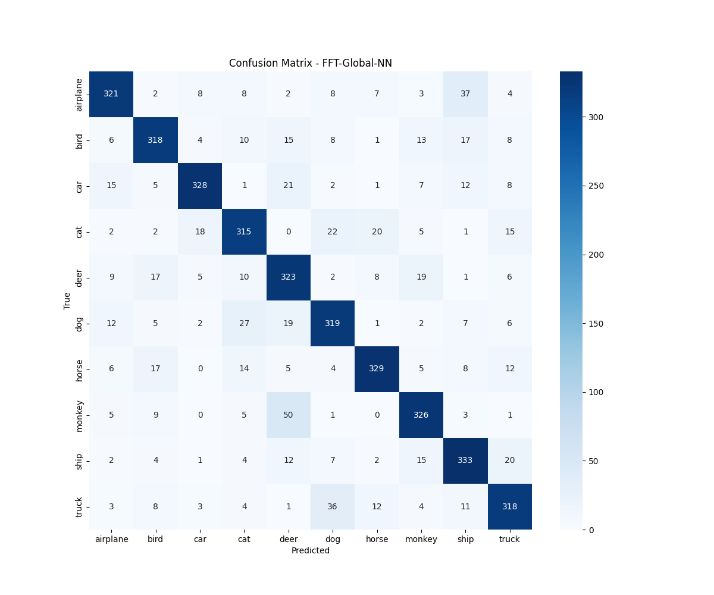
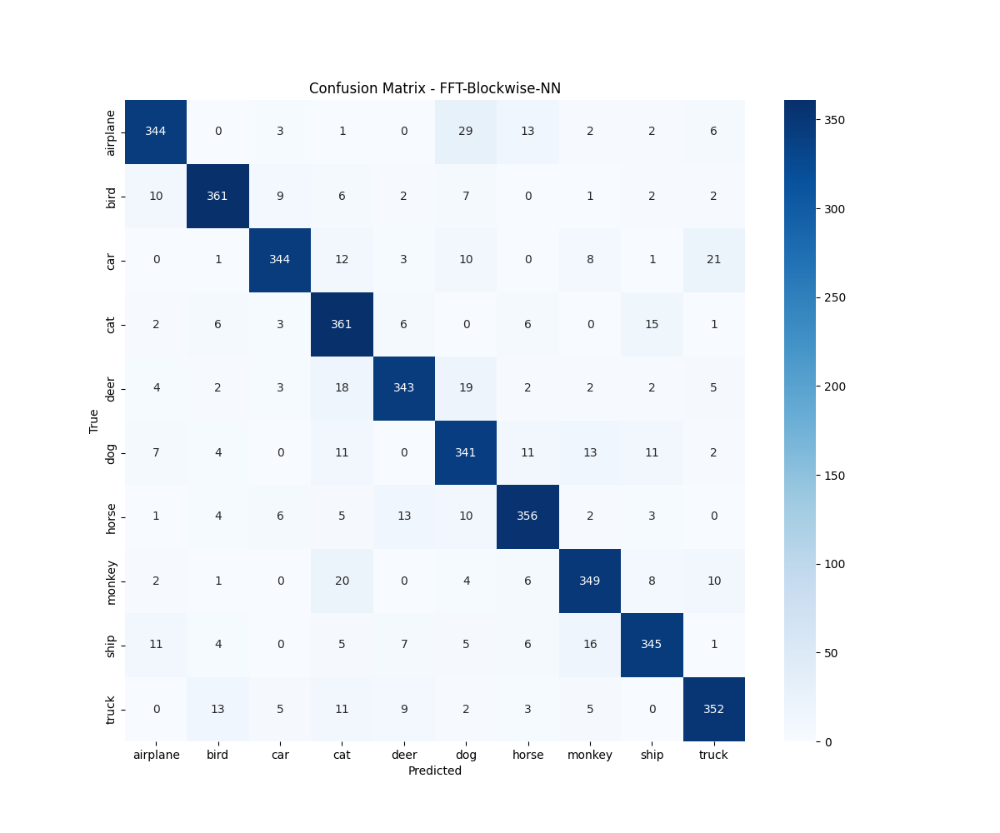
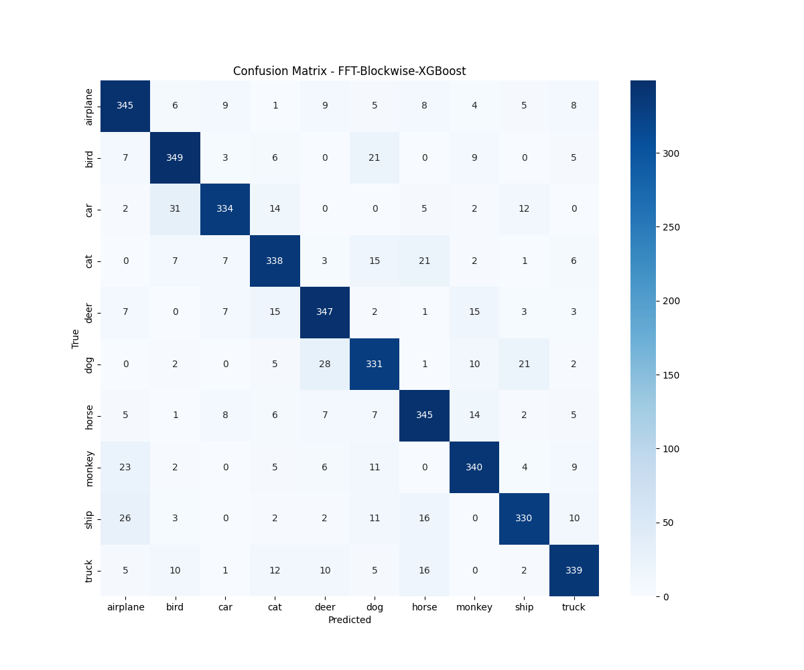

# Model Performance Comparison Report

This report provides a comprehensive evaluation of the different model architectures implemented in the SpecFace project. The models are evaluated on the test set across multiple performance metrics, including accuracy, F1-scores, robustness (MCC/Kappa), and probabilistic consistency (Log Loss).

## 1. Performance Summary

The following table compares the models on the primary evaluation metrics.

| Model Architecture | Accuracy | Bal. Acc | Prec (Macro) | Rec (Macro) | F1 (Macro) | Prec (Weight) | Rec (Weight) | F1 (Weight) | MCC | Kappa | Log Loss |
| :--- | :---: | :---: | :---: | :---: | :---: | :---: | :---: | :---: | :---: | :---: | :---: |
| **ResNet-18** | 0.9385 | 0.9380 | 0.9381 | 0.9383 | 0.9382 | 0.9385 | 0.9385 | 0.9385 | 0.9317 | 0.9316 | 0.2798 |
| **FFT-Global-NN** | 0.8101 | 0.8095 | 0.8098 | 0.8086 | 0.8092 | 0.8101 | 0.8101 | 0.8101 | 0.7895 | 0.7889 | 0.8523 |
| **FFT-Blockwise-NN** | 0.8784 | 0.8779 | 0.8782 | 0.8778 | 0.8780 | 0.8784 | 0.8784 | 0.8784 | 0.8651 | 0.8648 | 0.6892 |
| **FFT-Blockwise-XGB** | 0.8478 | 0.8472 | 0.8475 | 0.8473 | 0.8474 | 0.8478 | 0.8478 | 0.8478 | 0.8312 | 0.8308 | 0.4504 |

> [!NOTE]
> The **FFT-Blockwise-NN** model represents the proposed hybrid spatial-spectral approach, demonstrating significant performance gains over the global FFT approach and competitive results with the ResNet-18 baseline while focusing on spectral domain features.

## 2. Visualizations

### ROC Curves
The ROC curves demonstrate the trade-off between sensitivity and specificity for each model. The Area Under the Curve (AUC) is a key indicator of model performance across all possible classification thresholds.

### Confusion Matrices
The confusion matrices provide a detailed breakdown of correct and incorrect predictions per class, highlighting specific categories where the models may experience confusion.

#### ResNet-18

#### FFT-Global-NN

#### FFT-Blockwise-NN

#### FFT-Blockwise-XGBoost

## 3. Analysis and Key Findings

1.  **Spatial vs. Spectral**: The **ResNet-18** baseline remains the top performer in terms of raw accuracy, likely due to its deep hierarchical feature extraction in the spatial domain.
2.  **Global vs. Blockwise FFT**: Moving from global FFT features to **Blockwise FFT** significantly improved performance (from ~81% to ~88%). This suggests that capturing local frequency variations is crucial for complex image classification tasks like face/object recognition.
3.  **Neural Network vs. XGBoost**: For FFT features, the **Neural Network** architecture consistently outperformed **XGBoost** in terms of F1-score and Accuracy, although XGBoost maintained a competitive Log Loss.
4.  **Metric Consistency**: High MCC and Cohen's Kappa scores across all models confirm that the performance is robust and not biased towards specific classes, indicating a well-balanced dataset and effective training regime.

---
*Report generated automatically by `scripts/compare_models.py`*
